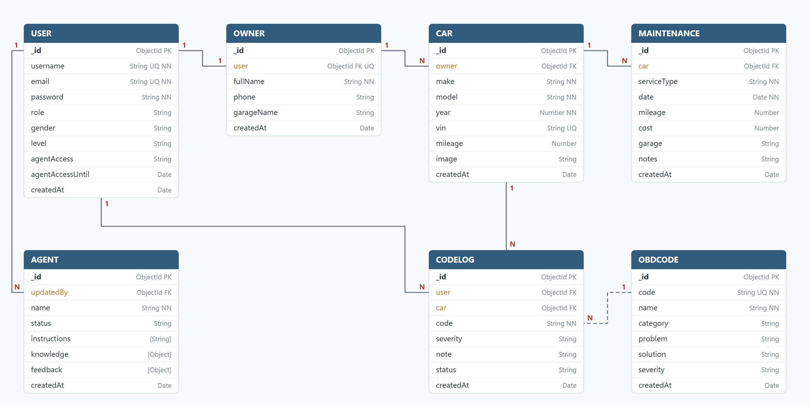

# AutoCode ERD

## Relationships
- **User 1 : 1 Owner**: every account has one owner profile
- **Owner 1 : N Car**: an owner can have many cars
- **Car 1 : N CodeLog**: each car keeps its own fault history
- **Car 1 : N Maintenance**: each car keeps its own service log
- **User 1 : N CodeLog**: who logged each fault
- **User 1 : N Agent**: the last admin who updated the assistant (`updatedBy`)
- **ObdCode 1 : N CodeLog** (dashed): matched by the code value, so a user can log a code that is not in the database yet

## Embedded
- `Agent.knowledge` and `Agent.feedback` are stored inside the Agent document

## Keys
- **PK** primary key, **FK** foreign key (reference), **UQ** unique, **NN** required
