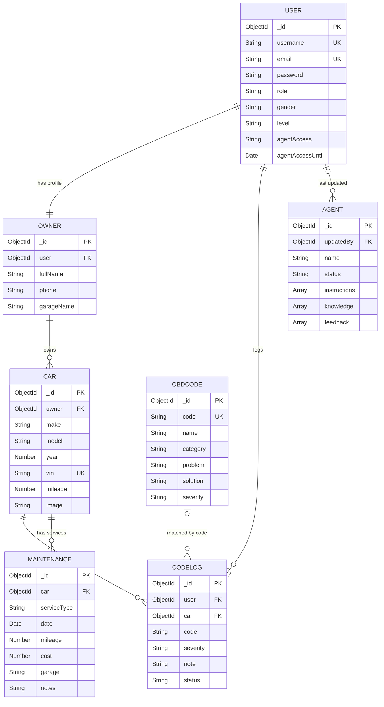

# Auto Code

## Overview

A web app that helps car owners track their OBD-II error codes. Each car in your garage keeps its own code history, every code shows how serious it is, and a built-in assistant understands what the car is doing (in Arabic or English), suggests the likely causes, and remembers the conversation.

Car faults are private: every user sees only their own cars and codes.

## Screenshots

_Coming soon_

## Technologies Used

1. **Node.js** / Express 5 — Backend
2. **MongoDB** / Mongoose — Database
3. **Bcrypt** — Password hashing
4. **express-session** + **connect-mongo** — Sessions
5. **EJS** — Templates
6. **CSS** — Styling

## Getting Started

```sh
git clone https://github.com/z8kwfdw5vc-arch/AutoCode.git
cd AutoCode
npm install
```

Create a `.env` file:

```
MONGODB_URI=your_mongodb_connection_string
SESSION_SECRET=generate_a_long_random_secret
PORT=3000
```

Generate `SESSION_SECRET` with:

```sh
node -e "console.log(require('crypto').randomBytes(32).toString('hex'))"
```

Load the OBD codes, then run the app:

```sh
node seed/importCodes.js
npm start
```

Sign up, then make your account the super owner:

```sh
node seed/makeAdmin.js <username> superowner
```

Look up any user's data from the terminal (site owner only):

```sh
node seed/userInfo.js
node seed/userInfo.js <username|email|id>
```

## User Stories

- As a user, I want to sign up and log in so my garage is private.
- As a user, I want to add, edit and delete my cars.
- As a user, I want to log an OBD-II code on a specific car so each car has its own fault history.
- As a user, I want to see how serious a code is: keep driving, visit a workshop soon, or stop the car now.
- As a user, I want to mark a code as Open, In Progress or Resolved.
- As a user, I want to describe what my car is doing and get the likely causes, what to check first, and how urgent it is.
- As a user, I want to manage my profile, change my password, and delete my account.
- As the super owner, I want to add, view, update and delete users, set their roles, and reset forgotten passwords.
- As the super owner, I want to give admins or moderators Agent Control, temporarily or permanently.
- As an admin or moderator with access, I want to approve user corrections so the assistant learns.

## Roles

| Role | Can do |
|------|--------|
| `superowner` | Everything: users CRUD, roles, passwords, Agent Control access. The only one who can see other users' cars and codes |
| `admin` | Manage normal users (no roles, no cars or codes). Agent Control if given access |
| `moderator` | Agent Control if given access |
| `user` / `owner` / `technician` | Their own garage, profile and the assistant |

Agent Control access is stored on the user (`agentAccess`, `agentAccessUntil`) and checked from the database on every request, so a temporary grant ends on its date and a removed grant stops at once.

## The Assistant

The assistant's diagnosis engine (`utils/diagnosis.js`) is a rule-based expert system, no outside AI service:

1. **Understands** 12 symptoms (shaking, stalling, overheating, gearbox…) in Arabic and English. Arabic spelling is normalized first.
2. **Scores** the codes each symptom points to. Codes that several symptoms point to rank higher, and the newest message counts double.
3. **Learns** from the data: codes that owners logged (same make when a car is picked) and codes the car had before rank higher.
4. **Replies** like a mechanic: what it likely is, what to check first from the cheapest, how urgent it is, and one follow-up question.
5. **Remembers** the last messages in the session, so answering its question refines the diagnosis.

Typing a code (for example `P0300`) shows the code's details, the car's history with it, and a one-click button to log it.

## Severity Levels

| Level | Meaning |
|-------|---------|
| `drive` | Keep driving, fix when convenient |
| `soon` | Visit a workshop soon |
| `stop` | Stop the car now |
| `unknown` | Code isn't in the database yet |

## Database Design

### ERD



### `User`
| Field | Type | Notes |
|-------|------|-------|
| `username` | String | unique |
| `email` | String | unique, lowercase |
| `password` | String | bcrypt hash |
| `role` | String | `user`, `owner`, `technician`, `moderator`, `admin`, `superowner` |
| `gender` | String | `male`, `female`, used for Arabic replies |
| `level` | String | `beginner`, `intermediate`, `expert` |
| `agentAccess` | String | `none`, `temporary`, `permanent` |
| `agentAccessUntil` | Date | end of a temporary grant |

### `Owner`
| Field | Type | Notes |
|-------|------|-------|
| `user` | ObjectId → User | unique |
| `fullName` | String | |
| `phone` | String | |
| `garageName` | String | optional |

### `Car`
| Field | Type | Notes |
|-------|------|-------|
| `make` / `model` | String | chosen from lists, or typed under Other |
| `year` | Number | chosen from a list |
| `vin` | String | optional, unique |
| `mileage` | Number | km, optional |
| `image` | String | photo URL found from Wikimedia by year, make and model |
| `owner` | ObjectId → Owner | |

### `ObdCode`
| Field | Type | Notes |
|-------|------|-------|
| `code` | String | unique, e.g. `P0300` |
| `name` | String | |
| `category` | String | `P`, `B`, `C`, `U` |
| `problem` / `solution` | String | |
| `severity` | String | `drive`, `soon`, `stop` |

9,533 codes imported from [OBDex](https://github.com/foerbsnavi/OBDex) (CC0), based on the SAE J2012 standard.

### `CodeLog`
| Field | Type | Notes |
|-------|------|-------|
| `user` | ObjectId → User | who logged it |
| `car` | ObjectId → Car | which car |
| `code` | String | e.g. `P0420` |
| `severity` | String | copied from `ObdCode`, or `unknown` |
| `note` | String | optional |
| `status` | String | `Open`, `In Progress`, `Resolved` |

### `Maintenance`
| Field | Type | Notes |
|-------|------|-------|
| `car` | ObjectId → Car | |
| `serviceType` | String | `oil`, `airFilter`, `tires`, `brakeFluid`, `battery`, `transmission` |
| `date` | Date | |
| `mileage` | Number | km at the service |
| `cost` / `garage` / `notes` | | optional |

### `Agent`
| Field | Type | Notes |
|-------|------|-------|
| `name` / `status` | String | status: `Active`, `Inactive`, `Maintenance` |
| `instructions` | [String] | shown under answers |
| `knowledge` | [Subdocument] | topic, content, approved |
| `feedback` | [Subdocument] | user corrections waiting for review |

### Relationships
- User 1:1 Owner, Owner 1:N Car, Car 1:N CodeLog, User 1:N CodeLog, Car 1:N Maintenance
- `CodeLog.code` matches `ObdCode.code` by value, so a user can log a code that is not in the database yet
- Agent knowledge and feedback are embedded
- Deleting a car deletes its logs and services; deleting a user deletes their owner profile, cars, logs and services

## Routes

| Method | Route | Description | Access |
|--------|-------|-------------|--------|
| GET | `/` | Home page | Everyone |
| GET / POST | `/auth/signup` | Sign-up form / create account | Everyone |
| GET / POST | `/auth/login` | Login form / log in | Everyone |
| GET | `/auth/logout` | Log out | Signed in |
| GET | `/obd` | Browse / search OBD codes (`?q=P03`) | Everyone |
| GET | `/garage` | My cars | Signed in |
| GET | `/garage/new` | Add car form | Signed in |
| POST | `/garage` | Create car | Signed in |
| GET | `/garage/:id` | Car details + code history | Car owner |
| GET | `/garage/:id/edit` | Edit car form | Car owner |
| PUT | `/garage/:id` | Update car | Car owner |
| DELETE | `/garage/:id` | Delete car and its logs | Car owner |
| POST | `/garage/:id/logs` | Log a code on this car | Car owner |
| PUT | `/garage/:id/logs/:logId` | Change repair status | Car owner |
| DELETE | `/garage/:id/logs/:logId` | Delete a log | Car owner |
| GET | `/agent` | Assistant | Signed in |
| POST | `/agent/ask` | Send a message to the assistant | Signed in |
| POST | `/agent/new` | Start a new conversation | Signed in |
| POST | `/agent/feedback` | Send a correction | Signed in |
| GET / PUT | `/agent/admin` | Agent Control / update settings | Agent Control access |
| POST / DELETE | `/agent/admin/knowledge(/:kid)` | Add / delete knowledge | Agent Control access |
| POST | `/agent/admin/codes` | Add a missing OBD code | Agent Control access |
| PUT / DELETE | `/agent/admin/feedback/:fid` | Approve / reject a correction | Agent Control access |
| GET | `/users` | All users, search by id (`?id=`) | Admin, super owner |
| GET / POST | `/users/new`, `/users` | Add user form / create user | Super owner |
| GET | `/users/:id` | User profile | Self, admin (normal users), super owner |
| PUT | `/users/:id` | Update username, email, role | Self, admin (normal users), super owner |
| PUT | `/users/:id/password` | Change / reset password | Self, admin (normal users), super owner |
| PUT | `/users/:id/agent-access` | Give Agent Control access | Super owner |
| DELETE | `/users/:id` | Delete user and everything they own | Self, admin (normal users), super owner |

## Project Structure

```
config/        DB connection
controllers/   auth, index, obd, garage, agent, user
middleware/    isSignedIn, isAdmin, isSuperOwner, canControlAgent, passUserToView
models/        User, Owner, Car, ObdCode, CodeLog, Agent, ...
routes/        auth, index, obd, garage, agent, user
seed/          importCodes, obdCodes, makeAdmin, userInfo
utils/         diagnosis, carImage, carModels, decodeDtc, decodeVin, roles
views/         EJS templates (garage/, users/, agent/, obd/, auth/, partials/)
public/        CSS
```

## Future Enhancements

- [ ] Fill make and year from the VIN in the car form (decoder ready in `utils/decodeVin.js`)
- [ ] Model dropdown based on the chosen make
- [ ] Edit a knowledge item in Agent Control
- [ ] Read codes directly from a Bluetooth OBD-II scanner (ELM327)
- [ ] Link parts and prices to each code
- [ ] Mobile-responsive dark mode

## Credits

Built by YOUSIF MONDEGAR
